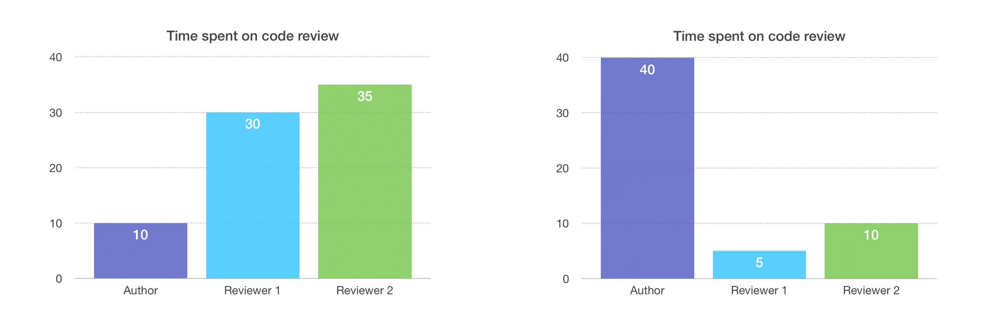
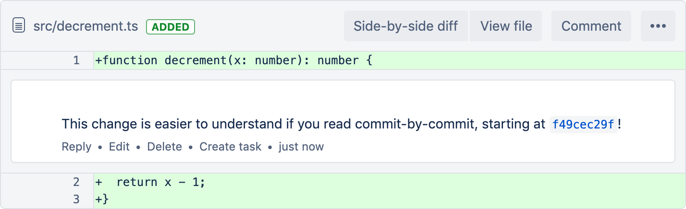
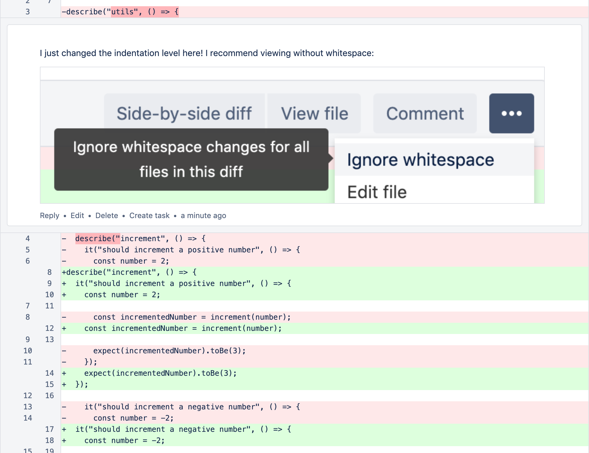
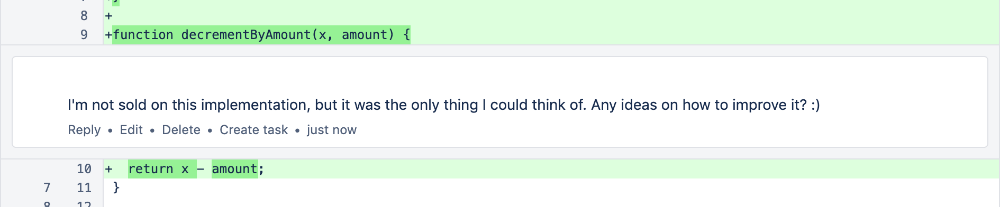

import CommitMessageEditor from "./commit-message-editor";
import CommitMessageTemplate from "./commit-message-template";
import DecrementTs1 from "./decrement-ts-1";
import DecrementTs2 from "./decrement-ts-2";
import EditRebase from "./edit-rebase";
import GitAddPatch from "./git-add-patch";
import GoodCommitHistory from "./good-commit-history";
import InfoBlock from "../../components/custom-blocks/info-block";
import ResetAndPatch from "./reset-and-patch";
import ResetAndPatchDiff from "./reset-and-patch-diff";
import RewordRebase from "./reword-rebase";

As a pull request (PR) author, it’s great to structure your PR in a way that’s easy for reviewers to review.

The theory is that, by _investing your time up front_, you save time for your ✨ _team as a whole_. ✨

---

**LEFT:** Author that did not structure their PR 😞

**RIGHT:** Author that did structure their PR 🙂

_According to this data from a questionable source, structuring your PRs will save your team 20 time units._

---

In this blog post, I’m going to share a few of my favorite techniques for structuring PRs! I’ve split them up into 3 categories.

- **Commit history:** Two techniques I use for rewriting history
- **Commit messages:** Template for filling out commit messages
- **Pull request creation:** Description, screenshots, comments and fixup commits

To keep this post beginner-friendly, I’ll share each `git` command used. That said, I recommend reading about [git rebase](https://www.atlassian.com/git/tutorials/rewriting-history/git-rebase) first if you’re not familiar with it.

---

## Commit history

For me, it’s implausible to have good commit history when I’m done developing a feature. I always try to do it, and I’m relatively successful at first. But then my code doesn’t work. And then, once I’m happy with the code, my commit history looks like this!

Thankfully, I can control what my commit history looks like before I open a PR! 👏

---

### Technique 1: Reset and patch

This is my favorite technique, since it’s quick, easy and works for most use cases.

The technique involves resetting my entire commit history and starting over. I run the following `git` CLI commands:

- `git checkout -b branch-name-after-rebase`
  - Create a new branch, in case I mess things up. (I know I can use the reflog to get back into a good state. Having another branch just makes me feel safer ok 😅)
- `git fetch`
- `git rebase origin/main`
  - Keep my branch up-to-date with main. Optional, but I’d rather fix any conflicts now. (If you run into the same conflict multiple times, I recommend [squashing into one commit](https://stackoverflow.com/questions/5189560/squash-my-last-x-commits-together-using-git/5189600) before rebasing on origin/main.)
- `git reset origin/main`
  - Remove all my commits, but leave my changes on the filesystem.

Afterward, it will look like I made all of my changes, but haven’t actually committed anything.

git status:

<ResetAndPatch />

git diff:

<ResetAndPatchDiff />

I have no commit history now, so I need to re-commit my changes. Before I do that, let’s take a brief detour. We need to decide what we want our commit history to look like at the end.

<InfoBlock>
  <GoodCommitHistory />
</InfoBlock>

#### Staging only _some_ changes

Following those guidelines, I’ll need to stage only _some_ changes from any given file. I like to use:

- `git add -p` (or `--patch`)
  - This command steps me through each change, and I just type `y(es)` or `n(o)` to stage individual changes.
  - You don’t need to use the `git` CLI unless you want to! My colleagues have recommended using Tower or Sourcetree.

Here, I’ll stage only the `increment` functions, but leave the `decrement` functions for the next commit.

<GitAddPatch />

_A video of `git add -p` usage_.

After that, it’s time to git commit the staged changes. I’ll repeat `git add -p` and `git commit` until all my changes have been committed, then I’m ready to open a PR! 🙌

---

### Technique 2: Put “moved code” in its own commit

For more complex PRs, my _Reset and patch_ technique isn’t enough. This usually happens when I moved a lot of code around.

To illustrate, let’s say I decide to move `decrement` to its own file, rather than keeping it in `utils.js` (it is very different from the other functions in that file, after all 😂)

Since I’ve decided to use TypeScript for new files in this repo, I also move it into a TypeScript file and rewrite it in TypeScript. The diff in Bitbucket’s web UI looks like this:

With this small example, it’s not terrible—but with larger examples, it’s hard to tell that the `return x - 1` line stayed the same, while the `function` line changed. The reviewer can’t easily see what code was _moved_ and what code was _changed_.

**How can we make this easier on the reviewer?**

What if I split it into 2 commits, where the first commit moved the code, then the second commit made the changes to the _function_ line? That way, the reviewer can ignore the first commit’s line-by-line diff and focus on reviewing the second commit.

---

This “history rewrite” is a little more tricky, since it requires committing an “in between” state that doesn’t match your final code changes.

To start with, we’ll run an interactive rebase, which allows us to change commits.

- `git rebase -i origin/main`

In the editor that pops up, change the commit we want to split from `pick` to `edit` (press `i` to enter insert mode in vim). That means the rebase will stop and let us edit the commit.

<EditRebase />

Save the rebase plan, and it will stop right after the edit commit. (`Esc`, `:wq`, `Enter` in vim, or [stop trying and configure git to use a different editor](https://stackoverflow.com/questions/2596805/how-do-i-make-git-use-the-editor-of-my-choice-for-commits) 😂)

Now, the commit has still been committed, but we can _amend_ it. I’ll amend the commit to only _move_ the code, by undoing the implementation changes I made.

Personally, I like load the old file in Bitbucket in a web browser, then copy and paste the old implementation overtop my new implementation\*1:

<DecrementTs1 />

Then I save, and:

- `git add decrement.ts`
- `git commit --amend`
  - This replaces the commit with a different commit. In this case, the replacement commit will only contain the code movement, not the implementation change. At this point, my implementation changes are “lost.”

After that, I undo (⌘-Z) 😂 my “paste” to recover my new implementation:

<DecrementTs2 />

and I add this “implementation change” as a new commit:

- `git add decrement.ts`
- `git commit`

Now we’re done with this part of the rebase! Run this command to finish up.

- `git rebase --continue`

---

Now, if you look at the commit diffs, you’ll see two separate commits:

First, one that just moves code:

Followed by one that only changes code:

Looks good! The reviewer doesn’t have to manually scan for what changed between the two implementations\*2.

- _(\*1) I’m sure there is a better way to add a “midpoint” commit (please share if you have one), but one benefit of rewriting history is that no one knows how hackily you did it._
- _(\*2) I wonder if there are any tools for visually viewing diffs better. What if Bitbucket identified code that moved, and offered a “changes after movement” diff?_

---

### Technique 3: Honorable mention: Do nothing

I leave this here non-sarcastically 😂. For some PRs, if rewriting commit history isn’t worth the value it provides to reviewers, then don’t do it. That’s a tradeoff for you and your team to decide 🙂

---

## Commit messages

Now that I’ve restructured my commits, I can go back and write commit messages! (yes I really do everything at the last minute!)

- `git rebase -i origin/main`
  - set every commit to `reword` (or `r`)

<RewordRebase />

Now, one-by-one, it will let me rewrite my commit messages. _You can hide the fact that you exclusively use misspellings of “wrok in progrses” for commit messages_.

### Writing good commit messages

Let’s start with an example commit message, then I can describe how to write it.

<CommitMessageEditor />

I write my commit messages by starting out with a template, which helps me sort out my thoughts.

<InfoBlock>
  <CommitMessageTemplate />
</InfoBlock>

I’ll fill that out, then delete any sections of the template I didn’t use. I don’t necessarily follow the template for my finalized commit message, but it helps jog my memory to remember why I wrote the code.

(One thing to note is the commit message summary, which is the first line of your message. There are recommendations to make this concise and specific, and whole blog posts about the topic! I’m still learning how to write these concise summaries, so my only advice here is to seek out other learning materials. 😅)

Once I’ve updated all my commit messages, it’s time to move on to opening the PR!

---

## Pull request creation

I like to keep the description brief because [I have a theory that most people don’t really read them](https://en.wikipedia.org/wiki/Banner_blindness). I prefer sticking to one-liners, bullet points and screenshots:

### Call-to-action comments

Since the default view is “review by file” instead of “reviewing by commit,” I’ll add a call-to-action (a comment 😉) near the top of the PR:

By calling out the “commit-by-commit” review method, you can make sure that your effort rewriting history wasn’t wasted!

---

There are a few other line-specific call-to-actions you can add, to guide the reviewer through their ✨ experience ✨

**Example 1:** Make it clear when a large diff is caused only by whitespace changes.

**Example 2:** Asking for specific feedback.

That way, the reviewer has a sense of what parts of the code need more thorough review.

---

### Making changes after code review

After my reviewers have made suggestions, I usually don’t want to rewrite history, since it makes it harder for them to see what changed.

In that case, I recommend using [`fixup` commits](https://thoughtbot.com/blog/autosquashing-git-commits). They allow you to clearly show reviewers what changed, but keep history clean when you’re ready to merge the PR.

---

## Conclusion

To recap, you’ve learned my preferred techniques for making PRs easy to review. Thanks to [@Kara Finley](https://twitter.com/untempurred) for encouraging me to write this blog post! 😊

Since these are just self-taught techniques, I’d love to hear other perspectives as well!
