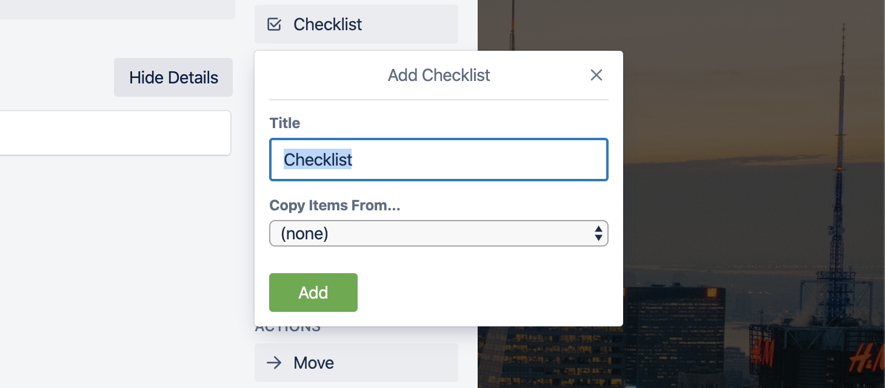
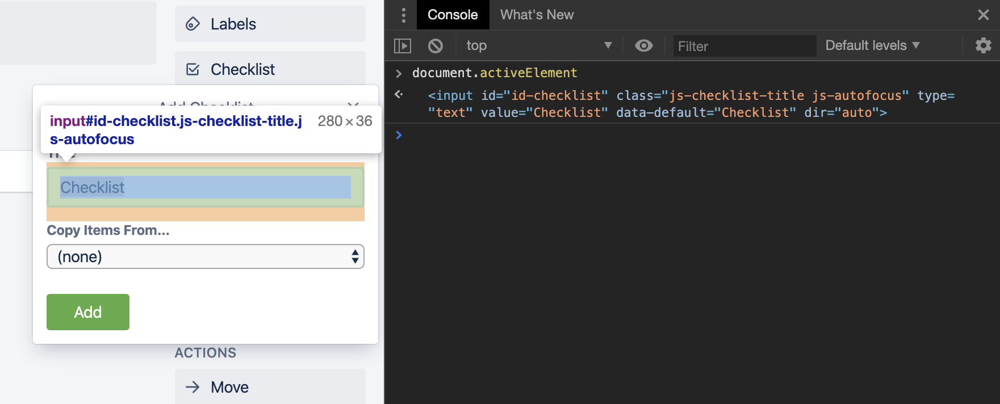
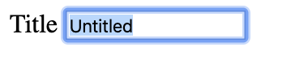
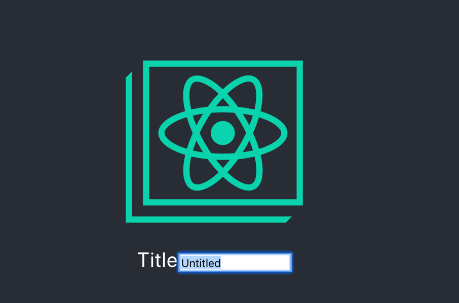

import InfoBlock from "../../components/custom-blocks/info-block";
import CssFocus from "./css-focus.mdx";

Autofocusing is a neat thing you can do to make your app easier to use.



In this screenshot of [Trello](https://trello.com/), the user clicked the _Add Checklist_ button. It opened a menu, with the _Title_ text input autofocused and its text selected.

With this autofocusing, the user doesn't have to click on the text input; they can just start typing.

There are a lot of different ways to autofocus a text input in React. In large apps with lots of legacy non-React code, it's been tricky for me to find one method that _always_ works. I wrote this blog post to help myself understand the subtle differences between each method.

## First off, what is focus?


This input is `focus`ed, but no text is selected. If the user starts typing, the text they type will go into that input. Only one element can be focused at a time.

You can check [which element is currently focused by running](https://developer.mozilla.org/en-US/docs/Web/API/DocumentOrShadowRoot/activeElement) `document.activeElement` in your console.



In this screenshot, `document.activeElement` is set to the _Title_ input, as we'd expect.

<InfoBlock>
  <CssFocus />
</InfoBlock>

## Autofocus

Typically, an element gains focus when the user...

- clicks on the element
- tabs (with the keyboard) to move focus to the element

When I say _autofocus_, I'm refering to focusing an element without direct user interaction on that specific element.

When done appropriately, autofocusing can simplify the user interface. Please consider how autofocusing will behave with various devices and assistive technologies, however.

> **Warning:** Automatically focusing a form control can confuse visually-impaired people using screen-reading technology and people with cognitive impairments. When `autofocus` is assigned, screen-readers "teleport" their user to the form control without warning them beforehand.

—[MDN on autofocusing](https://developer.mozilla.org/en-US/docs/Web/HTML/Element/input#autofocus)

In particular, aim to only autofocus after a relevant user interaction, and make sure the autofocused element has a descriptive `label`.

## Autofocus with HTML and DOM APIs

Before we get into React, I'm going to discuss how to add autofocusing behavior natively. I think this makes the React portion of this blog post easier to understand.

There are two ways to manually focus an element:

- The [`autofocus` attribute on `<input>` elements](https://developer.mozilla.org/en-US/docs/Web/HTML/Element/input#autofocus).
  - (This is different from the `autoFocus` prop in React, which we'll discuss later.)
- The [`focus()` method on `HTMLElement`s](https://developer.mozilla.org/en-US/docs/Web/API/HTMLOrForeignElement/focus).

### HTML autofocus attribute

Let's start with the `autofocus` attribute. To use it, you'd could create a raw HTML page like this, and declaratively specify that the input should autofocus when it appears:

```html
<!DOCTYPE html>
<html>
  <head> </head>
  <body>
    <label>
      Title
      <input type="text" autofocus value="Untitled" />
    </label>
  </body>
</html>
```

Open this file in your browser and you'll see this:


Nice! That's what we wanted.

---

#### Elements added to the DOM after page load

Autofocusing on page load could be useful, but we're interested in autofocusing an element that's dynamically added to the DOM later. Does the `autofocus` attribute still work in that case? Let's try it out.

This example adds an autofocused input to the page 5 seconds after load:

```html
<!DOCTYPE html>
<html>
  <head> </head>
  <body>
    <label>
      Title
      <!-- input will get appended here -->
    </label>

    <script>
      const input = document.createElement("input");
      input.setAttribute("autofocus", "");

      setTimeout(() => {
        document.querySelector("label").appendChild(input);
      }, 5000);
    </script>
  </body>
</html>
```

Load the page, wait 5 seconds. [You'll get different behavior depending on the browser you're using](https://github.com/facebook/react/issues/11159#issuecomment-335836758).

- **Firefox** will not focus the element.
- **Safari** will focus the element, regardless of if there are any other `autofocus` elements already in the document.
- **Chrome** will focus the element, but only if there are no other `autofocus` elements already in the document.

Oof.

(The HTML spec [requires that only one `autofocus` element exists in the document](https://www.w3.org/TR/html52/sec-forms.html#autofocusing-a-form-control-the-autofocus-attribute), so Chrome's and Safari's behaviors are probably equally valid 🤷‍♀️.)

### DOM API focus()

If you don't want to use the `autofocus` attribute (which I hope you don't, at this point 😂), there is a more imperative method: Calling `focus()` on the DOM element.

```html
<!DOCTYPE html>
<html>
  <head> </head>
  <body>
    <label>
      Title
      <input type="text" value="Untitled" />
    </label>

    <script>
      const input = document.querySelector("input");
      input.focus();
    </script>
  </body>
</html>
```

In this example, we don't have an `autofocus` attribute. However, we get the same behavior by finding the input and calling `focus` on it.

`focus()` is also more versatile than `autofocus`, since you can call it at any time. Maybe you want an input to focus after a button click, rather than right when it appears in the DOM.

---

#### Is focus() always the right choice?

Probably! The main difficulty I've had with it is calling `focus()` at the "right time." For example, calling `focus()` before the element is attached to the DOM does nothing.

```js
const input = document.createElement("input");

// Does not work!
input.focus();

document.querySelector("label").appendChild(input);

// Works!
input.focus();
```

That might seem obvious! Of course you can't focus something that isn't visible.

But! This bug can be harder to isolate if your app has a lot of moving parts. For example, in our app, we integrate new React components into legacy code like this:

```js
const root = document.createElement("div");
ReactDOM.render(<App />, root);
document.body.appendChild(root);
```

Notice that we render the React component on a detached element, then _later_ attach it to the DOM. It's the same bug as above, but more indirect.

---

That's it for autofocusing with HTML and DOM APIs! I'll cover two small tangential topics, then we can move on to React.

### Seleting input text

Up to this point, I've been blurring (😂) together the concepts of focusing and selecting. What is selection?


This input is `focus`ed _and_ all of its text is selected. `window.getSelection()` [allows you to see what text is selected](https://developer.mozilla.org/en-US/docs/Web/API/Window/getSelection).

Selecting text in an input can only be done imperatively with the `select()` method—there is not a declarative `autoselect` attribute.

To do it, you'd take the previous example, then add `select()` afterward.

```js
const input = document.querySelector("input");
input.focus();
input.select();
```



It selected! This is useful in situations where the text input has a "default" value pre-filled, but you want the user to be able to easily clear it.

### Blur events

While blur events won't come up again in this blog post, I want to make sure you're aware of the concept. The `blur` event the opposite of the `focus` event. [When an input _loses_ focus, a `blur` event is triggered on that input](https://developer.mozilla.org/en-US/docs/Web/API/Element/blur_event).

That's all I'll cover here. Just don't think we're talking about blurry images 😉

---

## Time for React!

Ok! Now that you understand how to autofocus text inputs with just the DOM and raw HTML pages, we can move on to React.

I'm going to go over a variety of methods—each have their use cases.

### autoFocus prop

The simplest method involves using the `autoFocus` prop on `input` elements ([Notice the uppercase F](https://reactjs.org/docs/dom-elements.html)). It's similar to (but also very different from) the `autofocus` attribute we learned about earlier.

```jsx
const MyComponent = () => (
  <label>
    Title
    <input type="text" defaultValue="Untitled" autoFocus />
  </label>
);
```

Run that, and you'll see that the input autofocuses when the component mounts.


Looks good! If you want to also autoselect the text in the input, you can add an `onFocus` event:

```jsx
<input
  type="text"
  defaultValue="Untitled"
  autoFocus
  onFocus={e => e.currentTarget.select()}
/>
```



That way, whenever the input is focused, all its text will be selected as well.

---

#### How does the autoFocus prop work?

When using the `autoFocus` prop, I was concerned that would use the `autofocus` attribute, which would lead to the same problems we saw above.

Interestingly, if you inspect the DOM, you won't see an `autofocus` attribute on the input element:


That's odd! Turns out the React team decided the `autofocus` attribute had [too many cross-browser inconsistencies. So they polyfilled the behavior](https://github.com/facebook/react/issues/11851#issuecomment-351672131). When you pass an `autoFocus` prop, React will internally call `focus()` when the `input` element mounts.

This is pretty neat! We're essentially getting all the benefits of manually calling `focus()`, but with the simplicity of the declarative `autofocus` attribute.

#### Does it always work?

There's one situation where I find that `autoFocus` doesn't work. Recall that I mentioned earlier how we render React components into some legacy parts of our app:

```js
const root = document.createElement("div");
ReactDOM.render(<App />, root);

// ...

someContainer.appendChild(root);
```

If you render your React component into a detached element, React will call `focus()` too soon. This will result in the `input` not focusing when your React tree gets added to the DOM.

We _could_ refactor the parts of our app where we combine React and non-React code. However, for the purposes of _learning_ and _fun_, I'm going to talk about some workarounds we can do entirely within React.

### React refs

What if we wanted to manually control when `focus()` gets called on the `input` DOM element? We can do that with _refs_ in React. [Refs allow us to access the actual DOM elements that React creates](https://reactjs.org/docs/refs-and-the-dom.html).

There are like practically 10 different ways to use refs in React (ok not _that_ many). They have subtle differences that often trip me up, so I'll be going over those differences.

- [useRef](https://reactjs.org/docs/hooks-reference.html#useref): For function components using hooks.
- [React.createRef](https://reactjs.org/docs/refs-and-the-dom.html): Similar to `useRef`, but for class components.
- [Callback refs](https://reactjs.org/docs/refs-and-the-dom.html): One extra use case over `useRef` and `React.createRef`: You'll get notified when a ref gets assigned.
- String refs: These are deprecated and I won't discuss them.

### useRef

Let's try `useRef` first.

```jsx
export const MyComponent = () => {
  const inputElement = useRef(null);

  useEffect(() => {
    if (inputElement.current) {
      inputElement.current.focus();
    }
  }, []);

  return (
    <label>
      Title
      <input type="text" defaultValue="Untitled" ref={inputElement} />
    </label>
  );
};
```

In this example, we use the `ref` prop on our `input` element. By setting the `ref` prop, React internally will assign the native DOM element to `inputElement.current`. With that element saved, we can later call `focus()` when the component mounts. Nice!

(If you're more familiar with class components, this example is _roughly_ analogous to using `React.createRef()` in the constructor and calling `focus()` in `componentDidMount`.)

#### Does this always work?

The `[]` dependency list in the `useEffect` call looks a bit suspicious to me. That means the effect will only run on component mount, and never again.

Thus, if we render the `input` element _after_ the component mounts, we won't focus it. In this example, imagine `loading` is `true` for the first 5 seconds.

```jsx
const MyComponent = ({ loading }) => {
  const inputElement = useRef(null);

  useEffect(() => {
    if (inputElement.current) {
      inputElement.current.focus();
    }
  }, []);

  if (loading) {
    return <div>loading...</div>;
  }

  return (
    <label>
      Title
      <input type="text" defaultValue="Untitled" ref={inputElement} />
    </label>
  );
};
```

In this case, the `useEffect` code already ran, before the `input` is visible! We need to call `focus` later, when the `input` becomes visible.

You might think we could update the `useEffect` dependency list to be more accurate:

```jsx
useEffect(() => {
  if (inputElement.current) {
    inputElement.current.focus();
  }
}, [inputElement.current]);
```

Turns out that doesn't work. In fact, you'll get a lint error if you have the `react-hooks/exhaustive-deps` ESLint rule set up.


The `useEffect` handler won't actually run, since React won't re-render after the ref gets attached. In this situation, the React documentation recommends using a callback ref instead.

> Keep in mind that `useRef` _doesn’t_ notify you when its content changes. Mutating the `.current`property doesn’t cause a re-render. If you want to run some code when React attaches or detaches a ref to a DOM node, you may want to use a [callback ref](https://reactjs.org/docs/hooks-faq.html#how-can-i-measure-a-dom-node) instead.

—[React documentation, useRef hook reference](https://reactjs.org/docs/hooks-reference.html#useref)

There are other ways to work around this problem, if you want. For example, you could split the `input` into another component, `AutofocusInput`. Then when `AutofocusInput` mounts, it will always be visible, since the loading is kept in the parent component.

Regardless, I'm going to move on to _callback refs_.

### Callback refs

When you pass a _function_ as the `ref` prop, you're using a _callback ref_.

```jsx
// Callback ref
<input
  ref={element => {
    /* do something */
  }}
/>
```

When we do this, React will instead _call_ the callback with the `element` parameter set to the input DOM element.

As a mental model, I like to imagine object refs as a special case of callback refs:

```jsx
const MyComponent = () => {
  const inputElement = useRef(null);

  return <input ref={inputElement} />;

  // roughly the same behavior as:

  return (
    <input
      ref={element => {
        // save element on `inputElement.current`
        // so that we can access it later
        inputElement.current = element;
      }}
    />
  );
};
```

However, when we use a callback ref, we can do more than just mutate an object. We're getting notified _when the ref gets set_, and can do additional work at that time. For this example, I'll call `focus()` in the callback itself.

```jsx
export const AutofocusFunctionComponent = () => {
  const callbackRef = useCallback(inputElement => {
    if (inputElement) {
      inputElement.focus();
    }
  }, []);

  return (
    <label>
      Title
      <input type="text" defaultValue="Untitled" ref={callbackRef} />
    </label>
  );
};
```

Notice the distinction again—instead of passing a ref object as the `ref` prop, we're passing the _function_ `inputElement => { ... }`.

It gets called in these situations:

- Called with a DOM element when the element is created
- Called with `null` when the element is destroyed

In this example, our autofocusing will work with the loading indicator situation we described above. It works since `callbackRef` will get called after the `input` element is created, which is exactly when we want to focus the `input`.

#### A note about useCallback

You'll notice I used `useCallback` when assigning `callbackRef`. I didn't directly pass an inline function to `ref`. This is important. If you don't use `useCallback`, like this:

```jsx
<label>
  Title
  <input
    type="text"
    defaultValue="Untitled"
    ref={inputElement => {
      // constructs a new function on each render
      if (inputElement) {
        inputElement.focus();
      }
    }}
  />
</label>
```

...then your `input` will re-focus on _every render_. Why?

Callback refs get called in one more situation I didn't mention: when the callback ref changes. You can think of React doing something internally like this when re-rendering:

```jsx
if (previousCallbackRef !== currentCallbackRef) {
  previousCallbackRef(null);
  currentCallbackRef(element);
}
```

If you construct a new function on each re-render, React will think it's a new callback ref. This will result in the old copy of the function _and_ the new copy of the function being called every render.

To avoid this, `useCallback` memoizes the function, so it only gets created once. That way, you re-use the same exact callback on subsequent renders.

> If the `ref` callback is defined as an inline function, it will get called twice during updates, first with `null` and then again with the DOM element. This is because a new instance of the function is created with each render, so React needs to clear the old ref and set up the new one. You can avoid this by defining the `ref` callback as a bound method on the class, but note that it shouldn’t matter in most cases.

—[React docs, caveats with callback refs](https://reactjs.org/docs/refs-and-the-dom.html#caveats-with-callback-refs)

The React docs say "defining the ref callback as a bound method on the class" is the solution, but that's referring to class components. If you're using a function component with hooks, [`useCallback` will get you equivalent memoization behavior](https://reactjs.org/docs/hooks-reference.html#usecallback).

#### Do callback refs always work?

The callback refs solution also broke for me in legacy parts of the app, where the React tree wasn't in the DOM yet. I was able to work around that by deferring the `focus()` call with a `setTimeout`, though 🤷‍♀️.

## Conclusion

In summary, we went over these techniques for autofocusing an `input` in React:

- `autoFocus` prop
- `useRef` hook
- Callback refs

As well as some workarounds for common issues:

- Separating `useRef` + `useEffect` into another component
- `setTimeout` in the callback ref

I would recommend that you use the `autoFocus` prop, unless you have odd circumstances (like I did) that prevent it from working.

Otherwise, I'm hoping that this comprehensive overview gives you the understanding you need to pick the correct solution for your specific app. Good luck!!
