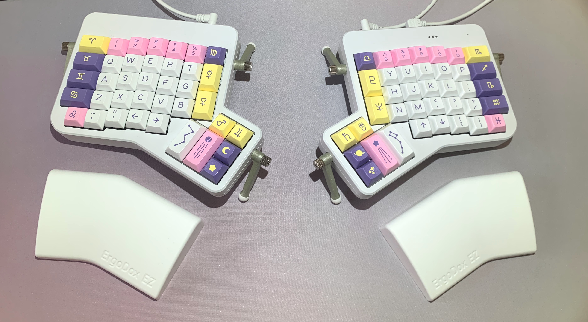
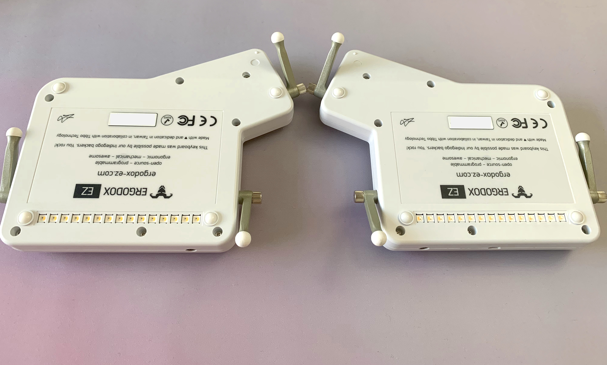
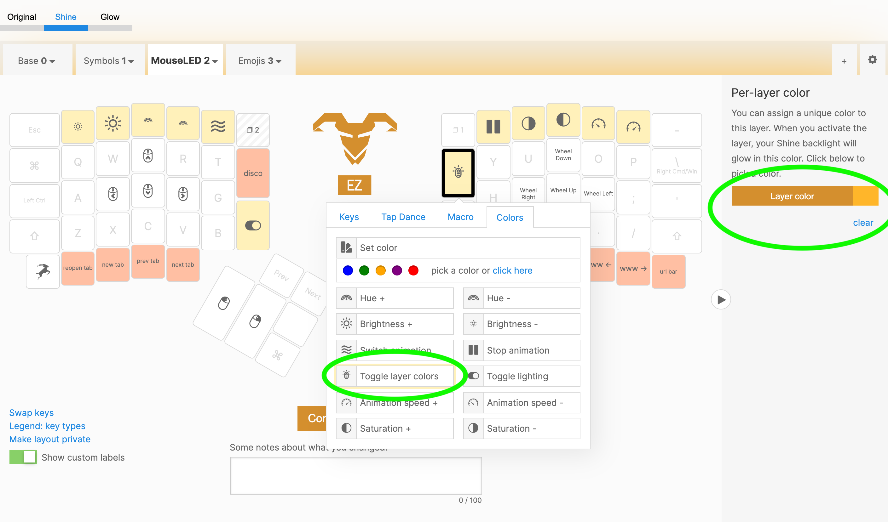
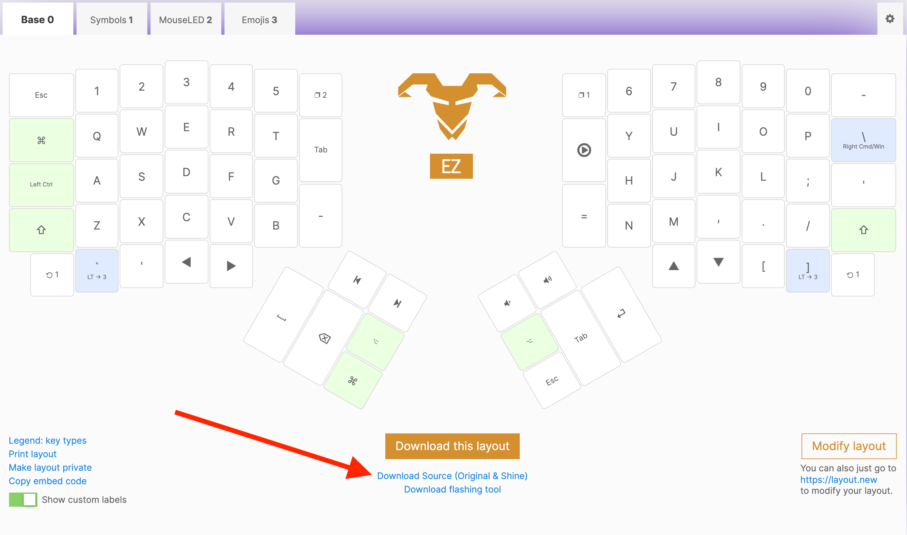
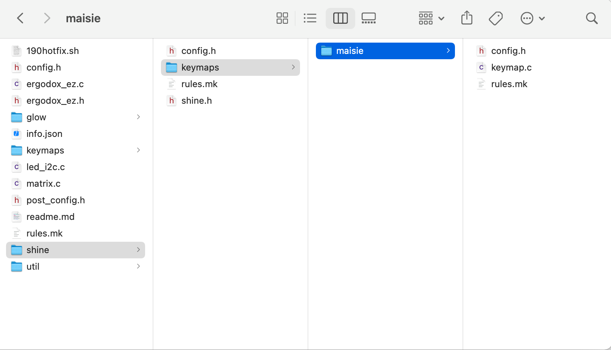
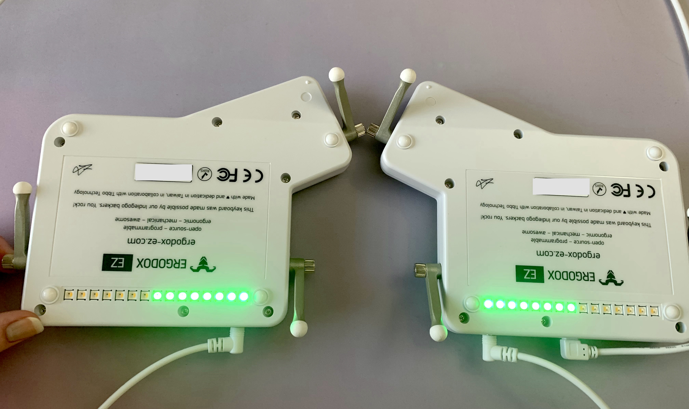

import InfoBlock from "../../components/custom-blocks/info-block";
import IdeCodeBlock from "../../components/custom-blocks/ide-code-block";
import Disclaimer from "./disclaimer";
import Eeprom from "./eeprom";
import {
  ChangeAllAnimation,
  ChangeSideAnimation,
  FadeOutAnimation,
  EaseComparisonAnimation,
  EaseAnimation,
} from "./led-animation";

In this post, I'll walk through implementing a custom animation. Each keypress lights up the LEDs with a random color, which then fade out upon releasing the key.

This video shows the finished product:

<iframe
  width="709"
  height="399"
  src="https://www.youtube-nocookie.com/embed/Wl5vp9pTlJA?rel=0"
  title="YouTube video player"
  frameborder="0"
  allow="accelerometer; autoplay; clipboard-write; encrypted-media; gyroscope; picture-in-picture"
  allowfullscreen
  className="youtube-embed"
></iframe>

## Keyboard details

The keyboard is an [ErgoDox EZ Shine](https://ergodox-ez.com/pages/customize) (configuration: white, with tilt kit, with wing rests, no keycaps, Cherry MX Brown).

The keycaps are [astrolokeys](https://astrolokeys.com/#leo) by [cassidoo](http://www.twitter.com/cassidoo) and [sailorhg](http://www.twitter.com/sailorhg). I had wanted to buy these cute pastel keycaps for a while, but I kept convincing myself I "didn't need them." (Then, when I did buy them, the alphas kit was out of stock, and the price had gone up—so the moral here is to buy things right away if you want them.)



The "Shine" model has 15 LEDs on the underside of each keyboard half. I chose this model instead of "Glow" because I thought backlit keys wouldn't look good with opaque keycaps.



## QMK development environment

ErgoDox EZ uses the [QMK firmware](https://docs.qmk.fm/) by default. The firmware includes [some LED animations](https://docs.qmk.fm/#/feature_rgblight?id=effects-and-animations) already, but I wanted to try building my own. To build my own animation, I first needed a development environment to compile the firmware from source.

In my opinion, the easiest way to get started is by making a layout with the [online configurator](https://configure.zsa.io/). The online configurator will generate source code that you can use as a base for your project.

In the configurator, I added a "layer color" to each layer and a key to toggle layer lighting. That way, the generated source code would include sample code that interacts with the LEDs.



Click the "Compile" button, then you'll see a link to download the source code for your layout.



The downloaded source code includes a `README.md` file explaining how to set up your development environment. I recommend reading that file for the full details. In case it's helpful, here is a high-level overview of the steps I took:

- Forked and cloned [zsa/qmk_firmware](https://github.com/zsa/qmk_firmware/). (ZSA maintains their own fork of QMK that's guaranteed to work with ErgoDox EZ.)
- Copied the source code downloaded from the online configurator into `qmk_firmware/​keyboards/​ergodox_ez/​shine/​keymaps/​maisie`, where `maisie` was a new folder and the name of my layout.
- Followed QMK's [getting started](https://docs.qmk.fm/#/newbs_getting_started) guide.

Then to compile:

- Ran `make ergodox_ez/shine:maisie` (where `maisie` is the name of my layout, matching the folder I created earlier.)
- That command created `ergodox_ez_shine_maisie.hex` in the top directory.
- Used [Wally](https://ergodox-ez.com/pages/wally) to flash the `hex` file to my keyboard.

Yay! We're ready to start making changes to the source code.

## Building the LED animation

Now, I'll walk you through my process for building the `disco_mode` animation! If you just want to see the final source code: [maisieink/qmk_firmware/keymap.c](https://github.com/maisieink/qmk_firmware/blob/023d2a6c0e05186a1ebc80d30ff60b8857ea4990/keyboards/ergodox_ez/shine/keymaps/maisie/keymap.c#L554-L654).

<InfoBlock>
  <Disclaimer />
</InfoBlock>

Our base source code will contain three files, `config.h`, `keymap.c`, and `rules.mk`. Go ahead and open all of those in your favorite text editor. We'll be doing most of our work in `keymap.c`.



We'll work on this project by breaking it up into smaller, incremental features.

### First iteration: Changing all LED colors on each keypress

Let's start with a simpler version of the animation: On each keypress, we'll change the color of the LEDs on the whole keyboard. We won't include a fadeout animation or try to change individual LEDs.

Add a new function to our `keymap.c` [named `post_process_record_user`](https://beta.docs.qmk.fm/using-qmk/advanced-keycodes/feature_macros#advanced-macros). This function is similar to `process_record_user`, but it gets called _after_ the keypress is handled. I figured that I shouldn't delay the normal keypress handling by messing around with the LEDs.

Next, copy the `rgblight` layer lighting code from our downloaded base code. The result will be:

<IdeCodeBlock
  language="c"
  title="📋 keymap.c (edited) — qmk_firmware"
  lineNumbers={false}
  code={
    `void post_process_record_user(uint16_t keycode, keyrecord_t *record) {
  if (record->event.pressed) {
    // Enable rgblight
    rgblight_enable_noeeprom();
` +
    `
    // Sets animation mode to RGBLIGHT_MODE_STATIC_LIGHT so that the built-in
    // animations don't interfere with our animation
    rgblight_mode_noeeprom(1);
` +
    `
    // Set all LEDs to a random hue, but keep the saturation and value
    // ("value" means "brightness") at their max values.
    rgblight_sethsv_noeeprom(rand() % 255, 255, 255);
  }
}`
  }
/>

<InfoBlock>
  <Eeprom />
</InfoBlock>

Great! Compile and flash this code, and we'll have a keyboard that _flashes_ colors on each keypress! 😋

---

<ChangeAllAnimation />

---

### Toggle button

The next thing we'll add is a _toggle button_. This flashy behavior is fun, but also distracting, so we want a way to disable it.

The [Custom Keycodes](https://beta.docs.qmk.fm/using-qmk/guides/custom_quantum_functions#custom-keycodes) docs can help, as well as copying the `TOGGLE_LAYER_COLOR` keycode behavior from our base code. Add the following lines to your `keymap.c`:

```c{5,12,18,24-29,36,42}
enum custom_keycodes {
  RGB_SLD = EZ_SAFE_RANGE,

  // Define a new custom keycode for our toggle button
  DISCO_TOGGLE,
};

// Add the keycode somewhere within your keymap. Here, I'm assigning it to the
// top-left key on the first layer.
const uint16_t PROGMEM keymaps[][MATRIX_ROWS][MATRIX_COLS] = {
  [0] = LAYOUT_ergodox_pretty(
    DISCO_TOGGLE,   KC_1,           KC_2,       // ...
    KC_TAB,         KC_Q,           KC_W,       // ...

// ...

// Create a variable to track the enabled/disabled state
bool disco_mode_enabled = 0;

bool process_record_user(uint16_t keycode, keyrecord_t *record) {
  switch (keycode) {
    // ...
    // Define the behavior for the new keycode.
    case DISCO_TOGGLE:
      if (record->event.pressed) {
        // Use a bitwise xor to toggle the value between 0 and 1
        disco_mode_enabled ^= 1;
      }
      return false;
  }
  return true;
}

void post_process_record_user(uint16_t keycode, keyrecord_t *record) {
  // Check if disco_mode is enabled before changing the LED colors.
  if (disco_mode_enabled) {
    if (record->event.pressed) {
      rgblight_enable_noeeprom();
      rgblight_mode_noeeprom(1);
      rgblight_sethsv_noeeprom(rand() % 255, 255, 255);
    }
  }
}
```

Now, wherever you place `DISCO_TOGGLE` in your keymap, you'll be able to press that key to toggle `disco_mode` on and off.

### Only change LEDs on one keyboard half

The next behavior I wanted to add was:

- Detect which half of the keyboard the keypress occurred on.
- Only change the LEDs on that half of the keyboard.

With a little bit of trial and error, I discovered:

- `record->event.key.row` ranges from 0–6 for keypresses on the left side of the keyboard, and 7–13 for keypress on the right side of the keyboard.
- There are [functions in `rgblight.c` for toggling the LEDs on just the left or right half of the keyboard](https://beta.docs.qmk.fm/using-qmk/hardware-features/lighting/feature_rgblight#direct-operation). (Due to insensitive naming, I just copied the function implementations rather than calling them.)

Add these lines:

```c{7-12,22-32}
bool process_record_user(uint16_t keycode, keyrecord_t *record) {
  switch (keycode) {
    // ...
    case DISCO_TOGGLE:
      if (record->event.pressed) {
        disco_mode_enabled ^= 1;
        // Move the initialization code into the DISCO_TOGGLE handler,
        // otherwise we'll accidentally clear the LEDs on the other half
        // of the keyboard on each keypress.
        rgblight_enable_noeeprom();
        rgblight_mode_noeeprom(1);
        rgblight_sethsv_noeeprom(0, 0, 0);
      }
      return false;
  }
  return true;
}

void post_process_record_user(uint16_t keycode, keyrecord_t *record) {
  if (disco_mode_enabled) {
    if (record->event.pressed) {
      if (record->event.key.row < 7) {
        // Set LEDs on left side of the keyboard
        rgblight_sethsv_range(rand() % 255, 255, 255,
          (uint8_t)RGBLED_NUM / 2, (uint8_t)RGBLED_NUM);
      } else {
        // Set LEDs on the right side of the keyboard
        rgblight_sethsv_range(rand() % 255, 255, 255,
          0, (uint8_t)RGBLED_NUM / 2);
        // rgblight_sethsv_range doesn't write to the EEPROM, which is why
        // there isn't a *_noeeprom version of the function.
      }
    }
  }
}
```

Let's try it out!



That wasn't quite what I was going for! Instead of lighting one side of the keyboard, it's lighting half of the LEDs on _both_ sides. 🤯

After a bit of frantic googling and searching through source code, I found out why this was happening:

```c
// Pick one of the modes
// Defaults to 15 mirror, for legacy behavior

// #define ERGODOX_LED_15 // Addresses 15 LEDs, but same position on both halves
// #define ERGODOX_LED_15_MIRROR // Addresses 15 LEDs, but are mirrored
// #define ERGODOX_LED_30 // Addresses all 30 LED individually
```

The cause:

> Defaults to 15 mirror, for legacy behavior

😳😳😳

Ok, so to define that setting, we need to open up our `config.h` file. It should look something like this:

<IdeCodeBlock
  language="c"
  title="📋 config.h (edited) — qmk_firmware"
  lineNumbers={false}
  code={`
/*
  Set any config.h overrides for your specific keymap here.
  See config.h options at https://docs.qmk.fm/#/config_options?id=the-configh-file
*/
#define ORYX_CONFIGURATOR
#define USB_SUSPEND_WAKEUP_DELAY 0
#define FIRMWARE_VERSION u8"K4JJp/OdVx9"
`}
/>

Add `#define ERGODOX_LED_30`.

```c{4}
#define ORYX_CONFIGURATOR
#define USB_SUSPEND_WAKEUP_DELAY 0
#define FIRMWARE_VERSION u8"K4JJp/OdVx9"
#define ERGODOX_LED_30
```

Now it's doing what we expect!

---

<ChangeSideAnimation />

---

### Fadeout animation

Next, I wanted to add a fadeout animation to make the lighting feel more lively. Let's go back to `keymap.c` to implement this animation.

First, set up variables for keeping track of the animation state between frames. Initialize them on each keypress.

```c{1-5,11-12,17-18}
uint8_t left_hue;
uint8_t right_hue;
uint8_t left_value;
uint8_t right_value;
uint16_t animation_timer;

void post_process_record_user(uint16_t keycode, keyrecord_t *record) {
  if (disco_mode_enabled) {
    if (record->event.pressed) {
      if (record->event.key.row < 7) {
        left_hue = rand() % 255;
        left_value = 255;

        rgblight_sethsv_range(left_hue, 255, left_value,
          (uint8_t)RGBLED_NUM / 2, (uint8_t)RGBLED_NUM);
      } else {
        right_hue = rand() % 255;
        right_value = 255;

        rgblight_sethsv_range(right_hue, 255, right_value,
          0, (uint8_t)RGBLED_NUM / 2);
      }
    }
  }
}
```

Now, we'll add a new function named `matrix_scan_user`. This function gets called repeatedly, which allows us to decrease the LED brightness as the animation progresses.

Keep in mind that adding too much work to `matrix_scan_user` will [cause performance problems](https://beta.docs.qmk.fm/using-qmk/guides/custom_quantum_functions#matrix-scanning-code):

> Be extremely careful with the performance of code in these functions, as it will be called at least 10 times per second.

We'll avoid doing extra work by exiting early if:

- `disco_mode` is disabled, or
- there is no active animation running

Also, we'll throttle the code to run no more than once every 20ms.

```c
void matrix_init_user(void) {
  animation_timer = timer_read();
}

void matrix_scan_user(void) {
  if (
    disco_mode_enabled &&
    (left_value > 0 || right_value > 0) &&
    timer_elapsed(animation_timer) > 20
  ) {
    animation_timer = timer_read();

    // Decrement the brightness (value) of the left LEDs by 5 per frame.
    if (left_value > 0) {
      left_value -= 5;
      rgblight_sethsv_range(left_hue, 255, left_value,
        (uint8_t)RGBLED_NUM / 2, (uint8_t)RGBLED_NUM);
    }

    // Decrement the brightness (value) of the right LEDs by 5 per frame.
    if (right_value > 0) {
      right_value -= 5;
      rgblight_sethsv_range(right_hue, 255, right_value,
        0, (uint8_t)RGBLED_NUM / 2);
    }
  }
}

```

Run that code, and the animation will look like this!

---

<FadeOutAnimation />

---

### Easing function

The animation didn't feel as smooth as I wanted it to, [mainly because of its linear easing](https://developers.google.com/web/fundamentals/design-and-ux/animations/the-basics-of-easing#linear_animations). There are plenty of articles explaining why linear animations feel dull, lifeless, and robotic—finding one of these articles and feeling appropriately judged is left as an exercise to the reader.

I tried out a few easing functions on the fadeout animation, and I landed on [easeOutCubic](https://easings.net/#easeOutCubic) as the one I liked the most.

Here's a side-by-side comparison. Both animations last the same length of time, though the cubic easing will be nearly 90% dimmed when the animation is halfway complete.

---

<EaseComparisonAnimation />

---

Let's implement [easeOutCubic, using easings.net's sample implementation](https://easings.net/#easeOutCubic).

> Below you see the code of this easing function written in TypeScript. The variable x represents the absolute progress of the animation in the bounds of 0 (beginning of the animation) and 1 (end of animation).
>
> ```ts
> function easeOutCubic(x: number): number {
>   return 1 - pow(1 - x, 3);
> }
> ```

Our implementation will look a little different, since our animation progress variable goes from 255 to 0, and we're animating from a brightness of 255 to 0. To adjust the bounds, we'll use `easeOutCubic` like this:

```c
eased_left_value = 255 * (1 - easeOutCubic(1 - left_value / 255))
```

Expanding and simplifying that expression results in:

```c
#define CUBIC_EASE(x) ((uint32_t)(x) * (x) * (x) / 255 / 255)
```

I'm using a [C preprocessor macro](https://gcc.gnu.org/onlinedocs/cpp/Macro-Arguments.html) to avoid [unnecessary function call overhead](https://stackoverflow.com/questions/5226803/inline-function-v-macro-in-c-whats-the-overhead-memory-speed). (Though who knows, if I defined it as a function, maybe the compiler would've inlined it anyway 🤷‍♀️). This is the first time I've written a C macro since college which made me feel…something.

I casted to `uint32_t` to avoid integer overflow, then moved division to the end of the macro to avoid losing precision from integer division. (I also could have casted to a `float` or `double`—I haven't done any performance testing to know if that would be a better option.)

Anyway, now that we've defined our easing function, let's go ahead and use it!

```c{2, 14, 20}
// Easing function defined from 255 to 0 (rather than 0.0 to 1.0)
#define CUBIC_EASE(x) ((uint32_t)(x) * (x) * (x) / 255 / 255)

void matrix_scan_user(void) {
  if (
    disco_mode_enabled &&
    (left_value > 0 || right_value > 0) &&
    timer_elapsed(animation_timer) > 20
  ) {
    animation_timer = timer_read();

    if (left_value > 0) {
      left_value -= 5;
      rgblight_sethsv_range(left_hue, 255, CUBIC_EASE(left_value),
        (uint8_t)RGBLED_NUM / 2, (uint8_t)RGBLED_NUM);
    }

    if (right_value > 0) {
      right_value -= 5;
      rgblight_sethsv_range(right_hue, 255, CUBIC_EASE(right_value),
        0, (uint8_t)RGBLED_NUM / 2);
    }
  }
}

```

And here's the final result! I hope you had fun! ⭐💫✨

---

<EaseAnimation />

---

## Additional features

If you're interested in further exploration, I added some additional features that are beyond the scope of this blog post.

- Changed the fadeout animation to only start after all keyboard keys have been released.
- Made LEDs near the keypress brightest, and LEDs further from the keypress dimmer.
- Used the [lower-level functions](https://beta.docs.qmk.fm/using-qmk/hardware-features/lighting/feature_rgblight#utility-functions) `sethsv` and `rgblight_set` manually. By making that change, I reduced the number of calls to `rgblight_set` and resolved some intermittent flickering behavior.

You can look at the [final source code](https://github.com/maisieink/qmk_firmware/blob/023d2a6c0e05186a1ebc80d30ff60b8857ea4990/keyboards/ergodox_ez/shine/keymaps/maisie/keymap.c#L554-L654) to see how those features are implemented. Thanks for reading! 👋
