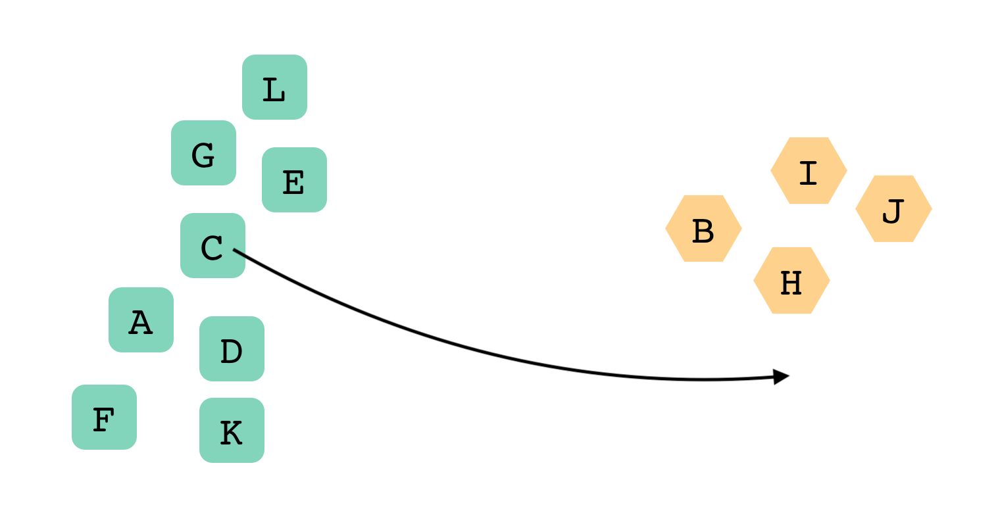
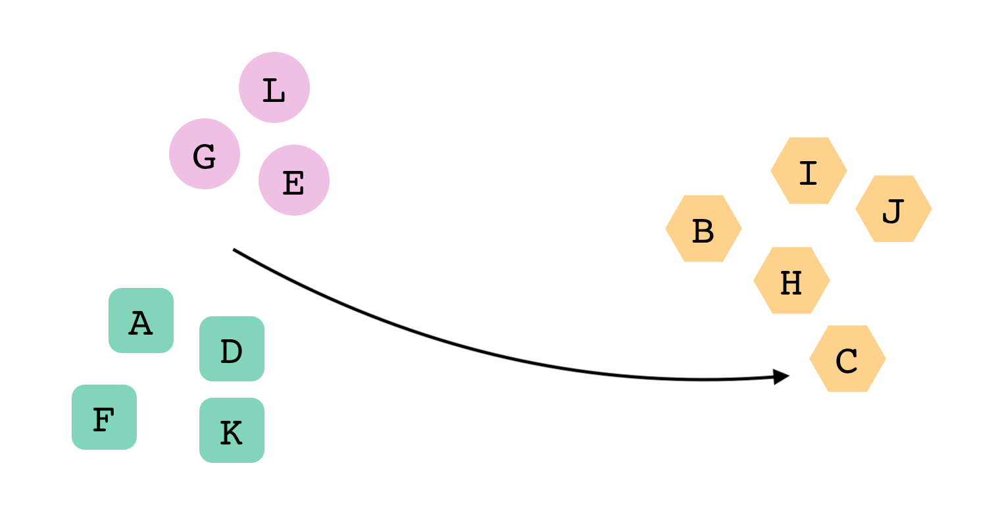
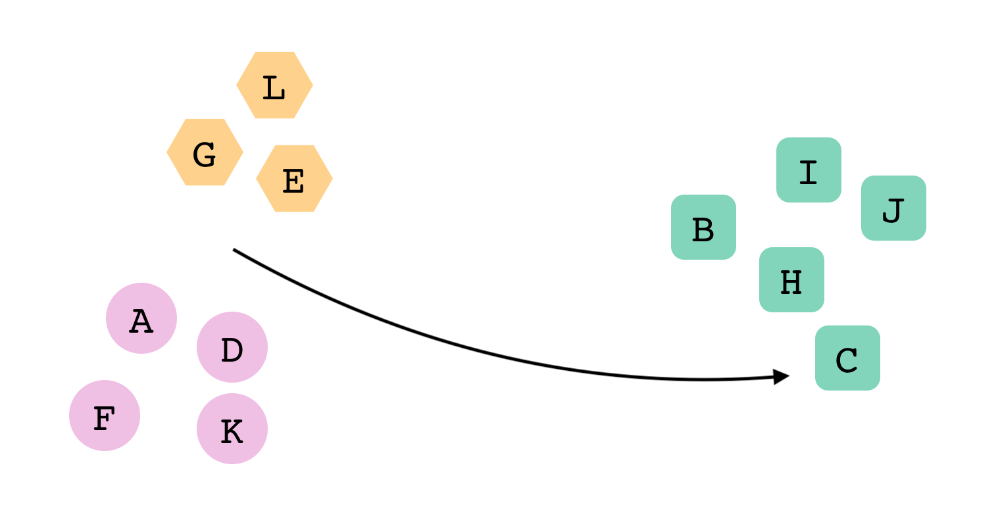
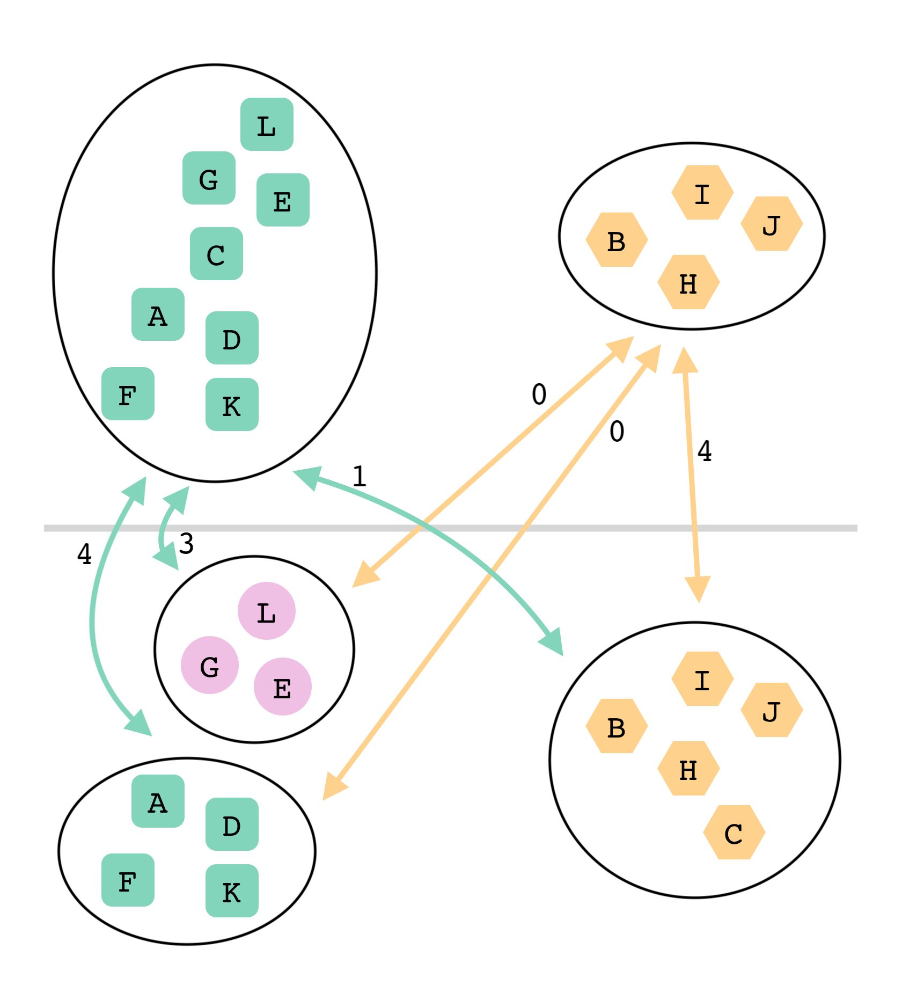

import InfoBlock from "../../components/custom-blocks/info-block";
import DeterminingClusters from "./determining-clusters";
import Greedy from "./greedy";
import { Table1, Table2, Table3, WikipediaTable } from "./tables";

A while ago, I was working on a proof-of-concept app, where you could group cards into "clusters" on a free-form board. My thought process was that users could use this app to brainstorm ideas, before transferring their ideas to a more structured format like a spreadsheet.

We didn't end up shipping the app, but I wanted to share the problem-solving process I used to develop it. In particular, this blog post describes how I maintained the cluster color mapping after the user moved cards around. My process mostly involved searching the internet for relevant prior art.

## Overview

Before we jump into the specific problem, let's take a step back to understand the general behavior of the app.

Whenever you moved a card, the app would automatically re-cluster all the cards. Depending on the specific movement, the app would sometimes add or delete a cluster. For example, here, I moved the C card from the green cluster...



...into the orange cluster.



Moving the C card split the green cluster in half, creating a new purple cluster.

<InfoBlock>
  <DeterminingClusters />
</InfoBlock>

## What made this behavior difficult to implement?

For me, the trickiest part was making sure clusters retained the same color after a re-clustering.

I was using an npm library to calculate the clusters. It would return something like this each time:

```js
[
  // green cluster
  ["A", "C", "D", "E", "F", "G", "K", "L"],

  // orange cluster
  ["B", "H", "I", "J"],
];
```

There wasn't much identifying information for each cluster, so I used the array index to determine each color—the first cluster was green, the second one orange, and so on. This clustering would render our first example above:


After the user moved the C card, we'd re-cluster the cards, and the clustering library would sometimes return the clusters in a different order from the last time. For example:

```js
[
  // green cluster
  ["B", "C", "H", "I", "J"],

  // orange cluster
  ["E", "G", "L"],

  // purple cluster
  ["A", "D", "F", "K"],
];
```

Since the app was choosing cluster colors based on array index, we'd get this result:



In the app, this was pretty jarring! After dropping the C card in its new location, _every other card_ on the screen changed its color.

I wanted to pick a better method of choosing cluster colors, a method that resulted in the least "noisy" animation in the app.

## Defining the problem

To get a more technical goal, I defined the "least noisy animation" as:

> after the user moves a card, minimize the number of individual cards that change color.

Let's see how this definition plays out in our previous example. Again, we start by moving the C card out of the green cluster:


We choose to keep the orange cluster orange, since it only got one new card. Since the green cluster split in half, we'll choose the larger half to keep the green color.


These choices resulted in only the C, E, G and L cards changing color. That's the fewest possible color changes for our example (which you can manually verify by trying every other permutation 😉).

Intuitively, picking the optimal colors seemed simple when I did it in my head! But I was having trouble writing code that could choose the colors. It got more complex when users were moving multiple cards at once, and so on.

## Rephrasing the problem

"Surely someone has already created an algorithm that solves this seemingly-simple problem!" I thought to myself.

So, I searched the internet for a data clustering libraries that had this exact behavior built in. Unfortunately, I couldn't find any, and definitely not any that were written in javascript 😭

The next step was to search for _similar_ problems, by rephrasing the problem in different ways, each getting more and more disconnected from my specific use case. Maybe one of these rephrasings would lead me to a problem that someone has already solved!

> Ok...what if we find out which new clusters are "most similar" to each of the old clusters, then each new cluster uses the color from its "most similar" old cluster? That's essentially what we want!

🤔

> What does "most similar" mean? Smallest distance between centroids? That'd probably be optimal, right?

🧐

> What if... "most similar" means that the old cluster and new cluster contain the largest overlapping set of cards? I think that's another way to phrase "fewest possible cards changing colors"!

🤨

> Ok—(get this!)—we compare every old cluster to every new cluster, and write down how many cards are common between each two? Like this?



😵‍💫 🥴 😵

And then...

> woah, that'd end up being like a "matrix" of "compatibility scores" between the old and new clusters...a MATRIX...that sure seems like something algorithmy people would be into

The matrix I built looked like this:

<Table1 />

Using this matrix, I could determine the optimal mapping between the old and new clusters! I'd choose one cell per column, each from a different row, such that the total sum of "overlapping cards" is as high as possible:

<Table2 />

For this solution,

- In the first column, we choose the bottom left cell, meaning **old cluster 0** maps to **new cluster 2**.
  - **new cluster 2** becomes green since **old cluster 0** was green.
- In the second column, we choose the top right cell, meaning **old cluster 1** maps to **new cluster 0**.
  - **new cluster 0** becomes orange since **old cluster 1** was orange.
- nothing maps to **new cluster 1**, so we give it a new, previously unused color.
- The total sum of overlapping cards is 4 + 4 = **8**, meaning that 8 cards will not change color after this re-clustering.

This matrix still described the same problem as earlier, but from a different perspective.

## Finding a similar problem

At this point, I still hadn't _solved_ the problem I was having. Again, I could intuitively arrive at solutions, but I couldn't describe an algorithm that solved the problem for any given input.

<InfoBlock>
  <Greedy />
</InfoBlock>

However, I had _rephrased_ my problem to something that was generalizable and easy to explain:

> Given a matrix of numbers, choose the optimal cells—a max of one per column and one per row—such that the total sum is as high as possible.

Instead of thinking harder, I went back to googling. I spammed keywords into the search box:


Eventually, I landed on a wikipedia article about [the Hungarian algorithm](https://en.wikipedia.org/wiki/Hungarian_algorithm#The_problem).

> Main article: [Assignment problem](https://en.wikipedia.org/wiki/Assignment_problem)
>
> Example [edit]
>
> In this simple example there are three workers: Paul, Dave, and Chris. One of them has to clean the bathroom, another sweep the floors and the third washes the windows, but they each demand different pay for the various tasks. The problem is to find the lowest-cost way to assign the jobs. The problem can be represented in a [matrix](<https://en.wikipedia.org/wiki/Matrix_(mathematics)>) of the costs of the workers doing the jobs. For example:
>
> <WikipediaTable />
>
> The Hungarian method, when applied to the above table, would give the minimum cost: this is $6, achieved by having Paul clean the bathroom, Dave sweep the floors, and Chris wash the windows.

## Reducing the problem

That was the thing!! I'd found it! The _ASSIGNMENT_ problem. Wow! Solvable with the "Hungarian algorithm." It was nearly identical to the problem I was describing, except for a few minor differences!

The minor differences were:

- The assignment problem minimized the total sum (of positive numbers), but I wanted to maximize the total sum.
- The assignment problem required a square matrix, but mine was 2x3.

Those differences weren't a significant issue. All we had to do was transform the data in our matrix:

<Table2 />

...into a format that the assignment problem would accept:

<Table3 />

I added a placeholder column to make the matrix square. The placeholder column represented a new color that hadn't been used in any of the old clusters.

With that transformation, I had reduced my obscure problem (how can I maintain color mapping between changes over time in a data clustering?) into a problem that has a well-documented solution!

## Writing the code

The assignment problem can be solved with the Hungarian algorithm, and I was easily able to find an implementation on npm: https://www.npmjs.com/package/munkres-js

That's great! I didn't even have to understand how the algorithm worked. All I had to do was transform my data into a format that the npm module understood, then transform it back into a result that I could use in the app.

The resulting code ended up being pretty succinct:

```js
export default function maintainColorMapping(
  cardClusters,
  prevCardClusters,
  prevColorMapping = null
) {
  const prevMappedCardClusters = prevColorMapping
    ? applyColorMapping(prevCardClusters, prevColorMapping)
    : prevCardClusters;

  const prevFlipped = flip(prevMappedCardClusters);
  const flipped = flip(cardClusters);

  const overlapCostMatrix = createMatrix(
    MAX_CLUSTERS,
    MAX_CLUSTERS,
    (idCluster, idPrevCluster) => {
      const prevIdCards = prevFlipped[idPrevCluster];
      const idCards = flipped[idCluster];
      return overlapCost(prevIdCards, idCards);
    }
  );

  const cheapestAssignment = munkres(overlapCostMatrix);

  return assignmentToColorMapping(cheapestAssignment);
}
```

## Conclusion

~~We didn't end up shipping the app, so I'm not sure I have a solid conclusion here 😂 I also got feedback that users may want to choose their own clusters—for example, by drawing a circle around a group of cards and then naming the cluster. Maybe I just dove even further into the sunk cost fallacy by finding a solution for a problem that didn't need to be solved.~~

Try looking at problems from multiple perspectives. You never know what you'll find. ✨
